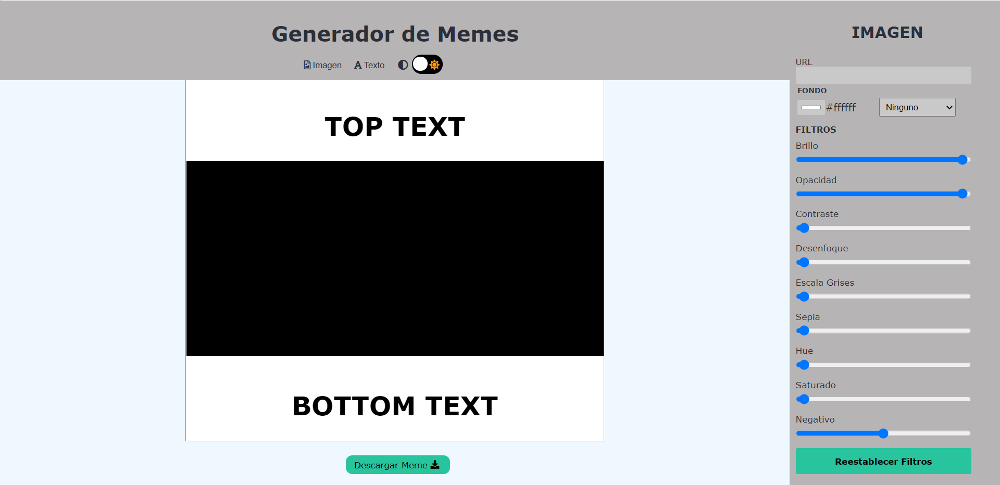
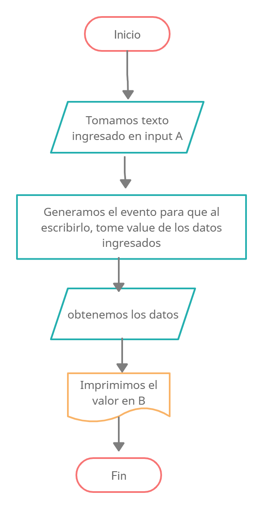

# 😂 Generador de Memes 😂

### Aplicación para generar tus propios memes, y luego de descargarlos puedas compartirlo en tus redes sociales

### Proyecto final del Módulo 2 de Desarrollo FrontEnd en ADA Itw. Hecho con Javascript, HTML5, y CSS 3.
### Podés acceder a mi proyecto y generar tu popio meme en este [enlace] https://github.com/Eugeniarinaldi/EditorDeMemes 

### Si queres tener el codigo en tu computadora deberas seguir estos pasos en tu terminal.

 - Ir al [repositorio](https://github.com/Eugeniarinaldi/EditorDeMemes)  
  - darle click al botón de forkear
  - Darle click al botón de code
  - Copiar la url
  - Abrir tu terminal y poner el comando de **git clone <url>**
  - Entrar a la carpeta del proyecto y abrirlo en tu IDE.

### Asi debería verse el proyecto

# Pseudocódigo de la primer seccion principal de textos superior e inferior

## Como logramos que al poner el texto en el input "top text" y "bottom text" se vea reflejado en la seccion correspondiente

 Inicio
- Tener identificado cuando el usuario escriba el texto
- Guardar ese texto ingresado
- Guardar el link que ingreso el usuario
- Identificar donde se verá reflejado
- Pintar el contenedor correspondiente

Fin
### Variables
A = Input superior donde ingreso primer texto
B = "TOP TEXT" área donde veremos reflejado los datos ingresados

# Diagrama de flujo 

 

### Gracias a mis profes Jonh y Leydy, sin su ayuda y paciencia no hubiera sido posible ❤

#### Hecho con 💪 & 🧡 por Euge Rinaldi